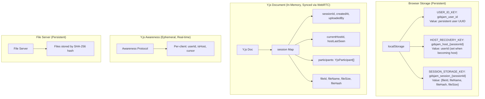
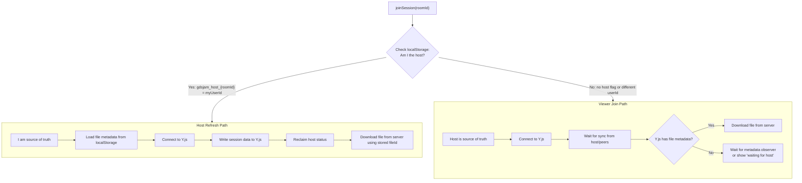

# Host Management and Transfer

**Date:** 2025-11-27
**Status:** In Progress (PR #24 pending review feedback)
**Related:** Issue #19, DevLog-001-08, DevLog-001-09
**Issue:** https://github.com/jwt625/gdsjam/issues/19
**PR:** https://github.com/jwt625/gdsjam/pull/24

## Problem Statement

When the session host leaves (closes tab, navigates away, or loses connection), remaining viewers have no way to continue managing the session. The host status is stored only as a local boolean in SessionManager, with no mechanism for recovery or transfer.

**Current Behavior:**
- Host uploads file, creates session, `isHost = true` locally
- Viewers join via URL, `isHost = false` locally
- Host leaves: no one can upload new files or manage session
- Host refreshes: loses host status, becomes viewer in own session

## Solution Overview

Implement comprehensive host management with three capabilities:

1. **Host Recovery:** Host retains status after page refresh (same browser, any tab)
2. **Host Claim:** Viewer can claim host when original host is absent (immediate claim allowed)
3. **Host Transfer:** Host can transfer status to a specific viewer (host-initiated only)

## Design Decisions

| Decision | Choice | Rationale |
|----------|--------|-----------|
| Host claim trigger | Host selects viewer (default: first joined) | Explicit control, predictable behavior |
| Original host returns after claim | New host remains host | Avoid disruption, CRDT convergence |
| Uploader special rights | None - host has full control | Simpler model, host is the authority |
| Intentional leave vs disconnect | Immediate claim allowed | No grace period needed for explicit leave |
| Viewer request host transfer | Not implemented | Too complicated for MVP |
| Host recovery storage | localStorage with sessionId | Enables same-browser cross-tab recovery |
| Participant naming | Unique names with collision detection | Check existing names, regenerate if collision |
| hostLastSeen frequency | Acceptable | Future viewport sync will also have frequent updates |

## Architecture

### YjsSessionData Interface

**File:** `src/lib/collaboration/types.ts`

Add strongly-typed interface for Y.js session map (currently uses `any`):

```typescript
/**
 * Y.js session map data structure
 * All fields stored in the shared "session" Y.Map
 */
export interface YjsSessionData {
  // Session identity
  sessionId: string;
  createdAt: number;

  // File metadata
  fileId: string;
  fileName: string;
  fileSize: number;
  fileHash: string;           // SHA-256 hex string
  uploadedBy: string;         // userId of original uploader (immutable)
  uploadedAt: number;

  // Host management (NEW)
  currentHostId: string;      // userId of current host
  hostLastSeen: number;       // timestamp for absence detection

  // Participant tracking (NEW)
  participants: YjsParticipant[];
}

export interface YjsParticipant {
  userId: string;
  displayName: string;        // Unique "Anonymous Animal" name
  joinedAt: number;
  color: string;
}
```

### Shared State (Y.js Session Map)

New fields in `session` map:
- `currentHostId`: userId of current host
- `hostLastSeen`: timestamp of last host activity (for absence detection)
- `participants`: array of participant info for ordering and unique naming

Existing fields (unchanged):
- `uploadedBy`: original file uploader (immutable, no special rights)
- `sessionId`, `fileId`, `fileName`, `fileHash`, `fileSize`, `uploadedAt`, `createdAt`

### Local State

- `localStorage`: `gdsjam-was-host-{sessionId}` flag for same-browser cross-tab recovery
- `SessionManager.isHost`: local boolean derived from Y.js state (`currentHostId === userId`)

### Host Presence Detection

Use Y.js Awareness API to track active participants. Host is considered absent when:
- Host's awareness state is removed (peer disconnected)
- For intentional leave: immediate claim is allowed (no grace period)
- For disconnect detection: grace period (10 seconds) to avoid false positives

## Implementation Phases

### Phase 0: Code Refactoring

Extract managers from SessionManager (currently 575 lines) to improve organization before adding new features.

**Target Structure:**

```
src/lib/collaboration/
├── SessionManager.ts      # Coordinator, session lifecycle (reduced)
├── HostManager.ts         # NEW: Host state, recovery, claim, transfer
├── ParticipantManager.ts  # NEW: Naming, colors, participant list
├── FileTransfer.ts        # Existing: File upload/download
├── YjsProvider.ts         # Existing: Y.js/WebRTC wrapper
└── types.ts               # Existing: Type definitions
```

**Dependency Flow:**

```
collaborationStore
       │
       ▼
SessionManager (facade)
       │
       ├──► HostManager ──► YjsProvider
       │
       ├──► ParticipantManager ──► YjsProvider
       │
       └──► FileTransfer ──► YjsProvider
```

**0.1 Create HostManager**

File: `src/lib/collaboration/HostManager.ts` (new)

Contents:
- `isHost`: Local boolean state
- `getCurrentHostId()`: Read from Y.js session map
- `setCurrentHostId()`: Write to Y.js session map
- `updateHostLastSeen()`: Update timestamp periodically
- `isCurrentHostConnected()`: Check via Awareness API
- `markHostForRecovery()`: Set sessionStorage flag
- `tryReclaimHost()`: Check flag and reclaim if valid
- `canClaimHost()`: Check if host absent for grace period
- `claimHost()`: Claim host status
- `transferHost(targetUserId)`: Transfer to another user
- `onHostChanged(callback)`: Subscribe to host changes
- `getHostWarningNeeded()`: Check if beforeunload warning needed

**0.2 Create ParticipantManager**

File: `src/lib/collaboration/ParticipantManager.ts` (new)

Contents:
- `generateUniqueDisplayName(userId, existingNames)`: Generate unique Anonymous Animal name
  - Hash userId to get base name
  - Check against existing participant names
  - If collision, append suffix or regenerate until unique
- `getUserColor(userId)`: Color from palette based on userId hash
- `getParticipants()`: List of all connected participants (ordered by joinedAt)
- `getParticipantCount()`: Number of connected users
- `setLocalAwarenessState()`: Update own presence info
- `onParticipantsChanged(callback)`: Subscribe to participant changes
- `registerParticipant(userId)`: Add self to Y.js participants array with unique name

Word lists (inline or separate constants):
- Adjectives: Anonymous, Curious, Clever, Swift, Gentle, Brave, etc.
- Animals: Otter, Panda, Fox, Owl, Dolphin, Koala, etc.

Name uniqueness algorithm:
1. Generate base name from userId hash: `{Adjective} {Animal}`
2. Get current participants list from Y.js
3. If name exists, try `{Adjective} {Animal} 2`, then `3`, etc.
4. Store final unique name in Y.js participants array

**0.3 Refactor SessionManager**

File: `src/lib/collaboration/SessionManager.ts`

Changes:
- Remove host-related code, delegate to HostManager
- Remove user color/list code, delegate to ParticipantManager
- Keep: session lifecycle, URL management, file transfer coordination
- Add: instantiate and coordinate HostManager, ParticipantManager
- Expose manager methods via facade pattern

**0.4 Update collaborationStore**

File: `src/stores/collaborationStore.ts`

Changes:
- Update imports if needed
- No API changes (SessionManager facade maintains compatibility)

### Phase 1: Core Host Management (MVP)

Solves Issue #19 using new HostManager.

**1.1 Track Host in Y.js**

File: `src/lib/collaboration/HostManager.ts`

Changes:
- Implement `getCurrentHostId()` and `setCurrentHostId()`
- Implement `updateHostLastSeen()` with periodic update interval
- Implement `isCurrentHostConnected()` using Awareness API

File: `src/lib/collaboration/SessionManager.ts`

Changes:
- Call `hostManager.setCurrentHostId(this.userId)` in `createSession()`

**1.2 Host Recovery on Refresh**

File: `src/lib/collaboration/HostManager.ts`

Changes:
- Add `HOST_RECOVERY_KEY_PREFIX = "gdsjam-was-host-"` constant for localStorage
- Implement `markHostForRecovery(sessionId)`: Set `{prefix}{sessionId} = true` in localStorage
- Implement `tryReclaimHost()`: Check localStorage flag, verify Y.js state matches, reclaim if valid
- Implement `clearHostRecoveryFlag(sessionId)`: Remove flag on explicit leave

File: `src/lib/collaboration/SessionManager.ts`

Changes:
- Call `hostManager.tryReclaimHost()` in `joinSession()` after connecting

File: `src/stores/collaborationStore.ts`

Changes:
- Update `beforeunload` handler to call `markHostForRecovery(sessionId)` if isHost
- On explicit `leaveSession()`, call `clearHostRecoveryFlag()` (no recovery for intentional leave)

**1.3 Viewer Host Claim**

File: `src/lib/collaboration/HostManager.ts`

Changes:
- Implement `canClaimHost()`: Check host absence (awareness state removed)
- Implement `claimHost()`: Update Y.js `currentHostId`, set local state
- Implement `onHostChanged()`: Y.js observer for `currentHostId`
- Note: No grace period for intentional leave; grace period only for disconnect detection

File: `src/stores/collaborationStore.ts`

Changes:
- Add `claimHost()` action
- Subscribe to host changes, update store state

**1.4 Leave Warning and Cleanup for Host**

File: `src/lib/collaboration/HostManager.ts`

Changes:
- Implement `getHostWarningNeeded()`: Check isHost and viewer count
- Implement `cleanupHostState()`: Clear `currentHostId` from Y.js on intentional leave

File: `src/stores/collaborationStore.ts`

Changes:
- Enhanced `beforeunload`: Check `getHostWarningNeeded()`, show warning
- Call `markHostForRecovery()` before warning (for refresh recovery)
- On `leaveSession()`: Call `cleanupHostState()` to update shared state for all peers

### Phase 2: Participant List UI

Build on ParticipantManager (created in Phase 0) to add UI.

**2.1 Awareness State Integration**

File: `src/lib/collaboration/ParticipantManager.ts`

Changes:
- Implement `setLocalAwarenessState()`: Set `{ name, color, isHost }` in Awareness
- Call on connect and when host status changes

File: `src/lib/collaboration/SessionManager.ts`

Changes:
- Call `participantManager.setLocalAwarenessState()` after session join/create

**2.2 Participant List UI**

File: `src/components/ParticipantList.svelte` (new)

Contents:
- Display connected users with name and color indicator
- Show host badge next to current host
- "You" indicator for current user
- Subscribe to `participantManager.onParticipantsChanged()`

### Phase 3: Host Transfer

Host-initiated transfer to specific viewer. Host selects which viewer to transfer to.

**3.1 Transfer Logic**

File: `src/lib/collaboration/HostManager.ts`

Changes:
- Add `transferHost(targetUserId)`: Update `currentHostId`, set own `isHost = false`
- Validate target is connected before transfer
- Add `getTransferCandidates()`: Return viewers sorted by `joinedAt` (first joined = default)

File: `src/lib/collaboration/SessionManager.ts`

Changes:
- Delegate to `hostManager.transferHost()`

**3.2 Transfer UI**

File: `src/components/ParticipantList.svelte`

Changes:
- Add "Make Host" button next to each viewer (visible only to current host)
- Default selection: first joined viewer (highlighted or pre-selected)
- Confirmation dialog before transfer

File: `src/stores/collaborationStore.ts`

Changes:
- Add `transferHost(userId)` action

## Bug Fixes

### Viewer File Sync Regression (2025-11-27)

**Problem:** After Phase 0 refactoring, viewers no longer received file sync from host when host uploaded before creating session.

**Root Cause:** The refactored `joinSession()` added Y.js writes (`tryReclaimHost()`, `registerParticipant()`) that executed before Y.js sync completed. These writes conflicted with and overwrote the host's session data (including file metadata).

**Original behavior:** `joinSession()` only connected to Y.js room with no document writes.

**Fix:** Made `joinSession()` async and added `waitForSync(5000)` before any Y.js writes. The viewer now waits for sync to complete, ensuring the host's data is present before writing participant info.

**Files Changed:**
- `src/lib/collaboration/YjsProvider.ts` - Added `waitForSync()` method
- `src/lib/collaboration/SessionManager.ts` - Made `joinSession()` async
- `src/stores/collaborationStore.ts` - Made store action async
- `src/App.svelte` - Added await to joinSession call

## State Architecture and Ground Truth (2025-11-27)

### Design Intent

The application has two modes:
1. **No Session (Pure FE Viewer):** Local-only GDS file viewer. No server communication. Refresh clears everything. This is expected behavior.
2. **With Session (Collaborative):** Real-time collaboration with host/viewer model. Server stores files, Y.js syncs state.

### Ground Truth Rules

| Role | Ground Truth | Rationale |
|------|--------------|-----------|
| **HOST** | localStorage | Host owns the session. Can always restore after refresh. |
| **VIEWER** | Y.js (from host/peers) | Viewers receive state from host. Cannot restore alone. |

### State Storage Locations



### State Recovery Matrix

| State | HOST can recover from | VIEWER can recover from |
|-------|----------------------|------------------------|
| User Identity | localStorage | localStorage |
| Host Status | localStorage flag | Y.js (from host) |
| File Content | File server (via stored fileId) | File server (via Y.js fileId) |
| File Metadata | localStorage | Y.js (from host) |
| Participants List | Cannot (ephemeral) | Cannot (ephemeral) |
| Session Existence | URL `?room=xyz` | URL `?room=xyz` |

### Correct joinSession Flow



### Key Insights

1. **Host OWNS the session data** - Their localStorage is authoritative
2. **Y.js is a broadcast channel** - Distributes host's data to viewers
3. **Viewers are receivers, not sources** - They defer to Y.js state
4. **No session = no persistence** - Without `?room=`, app is stateless viewer
5. **pendingFile is intentionally not persisted** - Pre-session state should not survive refresh

### Bugfixes (2025-11-27)

**Bug 1: Host Refresh Not Recovering Session**

The original `joinSession()` did not distinguish host from viewer:
- Connected to Y.js and waited for sync (5s timeout)
- Timed out if no peers were connected
- Never restored file metadata from localStorage

**Fix:** Implemented HOST PATH vs VIEWER PATH in `SessionManager.joinSession()`:
- Check localStorage for host recovery flag FIRST
- HOST PATH: Load metadata from localStorage, connect to Y.js, write authoritative state
- VIEWER PATH: Connect to Y.js, wait for sync from host/peers

**Bug 2: state_unsafe_mutation Error Blocking Render**

Svelte 5 threw `state_unsafe_mutation` errors during render, preventing the GDS file from displaying even after successful download.

**Root Cause:** `collaborationStore.getSessionManager()` and `isFileAvailable()` used `update()` to read state, which triggered state mutations during the render cycle.

**Fix:** Changed getter methods to access the closure-scoped `sessionManager` variable directly instead of using `update()`:
```typescript
// Before (broken):
getSessionManager: (): SessionManager | null => {
    let manager: SessionManager | null = null;
    update((state) => { manager = state.sessionManager; return state; });
    return manager;
}

// After (fixed):
getSessionManager: (): SessionManager | null => {
    return sessionManager;
}
```

**Bug 3: Unnecessary 5-Second Delay on Host Refresh**

HOST PATH was waiting for Y.js sync (5s timeout) even though host has all metadata in localStorage and file is on the signaling server.

**Fix:** Removed `waitForSync()` call from HOST PATH. Host connects to Y.js without waiting, then writes authoritative metadata immediately.

**Bug 4: Host Re-Upload Not Syncing to Viewers**

When host uploaded a new file (replacing an existing one), viewers did not receive the update without manually refreshing the page.

**Root Cause:** The file observer in `App.svelte` had two issues:
1. Used a boolean `hasDownloaded` flag - once set to `true` after the first download, subsequent file changes were ignored.
2. The observer was only set up in the `else` branch (when no file was initially available). Viewers joining after the host uploaded would download immediately but no observer would be set up for subsequent uploads.

**Fix:** Refactored `App.svelte` to:
- Replace `hasDownloaded` boolean with `currentFileId: string | null` to track the actual file ID
- Move observer setup before the initial file check so it is always set up
- Detect new files when `fileId !== currentFileId` and trigger download

**Files Changed:**
- `src/App.svelte` - Refactored file observer to always listen for new file uploads

## Risk Mitigations

| Risk | Mitigation |
|------|------------|
| Race condition: simultaneous claims | Y.js CRDT ensures convergence; last write wins, all peers see same final state |
| Original host returns after claim | New host remains host (design decision); original becomes viewer |
| Split brain (network partition) | Y.js syncs on reconnection; UI shows sync status |
| Host refresh during claim window | localStorage flag + userId + sessionId match prevents false claims |
| Name collision | Unique name generation with suffix fallback |

## Testing Checklist

### Phase 0: Refactoring Tests
- [ ] All existing functionality works unchanged after refactoring
- [ ] SessionManager facade maintains API compatibility
- [ ] No regressions in file upload/download
- [ ] No regressions in session create/join/leave

### Phase 1: Host Management Tests

**Unit Tests (HostManager.ts):**
- [ ] `setCurrentHostId()` updates Y.js session map correctly
- [ ] `getCurrentHostId()` reads from Y.js session map
- [ ] `isCurrentHostConnected()` correctly checks Awareness API
- [ ] `markHostForRecovery()` sets localStorage flag with sessionId
- [ ] `tryReclaimHost()` succeeds when flag exists and userId matches
- [ ] `tryReclaimHost()` fails when userId doesn't match currentHostId
- [ ] `canClaimHost()` returns true when host awareness is absent
- [ ] `claimHost()` updates Y.js and local state atomically
- [ ] `cleanupHostState()` clears currentHostId from Y.js
- [ ] `onHostChanged()` callback fires when currentHostId changes

**Integration Tests:**
- [ ] Host refreshes page → automatically reclaims host status (same browser)
- [ ] Host refreshes in different tab → reclaims via localStorage
- [ ] Host closes tab → warning shown (if viewers present)
- [ ] Host explicitly leaves → shared state cleaned up, viewers see host absent immediately
- [ ] Viewer can claim immediately after host intentional leave (no grace period)
- [ ] Viewer claim after host disconnect → grace period applies
- [ ] Two viewers attempt claim simultaneously → one succeeds, both see same final state
- [ ] Original host returns after viewer claimed → new host remains host

### Phase 2: Participant Management Tests

**Unit Tests (ParticipantManager.ts):**
- [ ] `generateUniqueDisplayName()` produces deterministic base name from userId
- [ ] `generateUniqueDisplayName()` adds suffix on collision ("Panda 2", "Panda 3")
- [ ] `getUserColor()` returns consistent color for same userId
- [ ] `getParticipants()` returns participants sorted by joinedAt
- [ ] `registerParticipant()` adds self to Y.js with unique name

**Integration Tests:**
- [ ] All participants see same user list
- [ ] Display names are unique across all peers
- [ ] New viewer joining gets unique name (no collision with existing)
- [ ] Host indicator updates when host changes
- [ ] Participant list updates when peer joins/leaves

### Phase 3: Host Transfer Tests

**Unit Tests:**
- [ ] `getTransferCandidates()` returns viewers sorted by joinedAt
- [ ] `transferHost()` updates currentHostId to target
- [ ] `transferHost()` fails if target not connected

**Integration Tests:**
- [ ] Host can transfer to any viewer
- [ ] Default transfer candidate is first joined viewer
- [ ] Transfer updates all clients immediately (Y.js sync)
- [ ] Former host becomes viewer, can no longer upload
- [ ] New host can upload files

### YjsSessionData Type Tests
- [ ] All Y.js session map accesses use YjsSessionData interface
- [ ] TypeScript catches type errors on session map access
- [ ] Backward compatibility with existing sessions (graceful handling of missing fields)

## TODO

Phase 0 (Refactoring): COMPLETE
- [x] Add `YjsSessionData` and `YjsParticipant` interfaces to `types.ts`
- [x] Create `HostManager.ts` with host state interface (stub methods)
- [x] Create `ParticipantManager.ts` with participant/naming interface (stub methods)
- [x] Extract `getUserColor()` from SessionManager to ParticipantManager
- [x] Extract `getConnectedUsers()` logic to ParticipantManager
- [x] Update SessionManager to use HostManager and ParticipantManager
- [x] Update all Y.js session map accesses to use `YjsSessionData` type
- [x] Verify collaborationStore works unchanged (facade pattern)
- [ ] Run existing tests to confirm no regressions

Phase 1 (Issue #19 - Host Management): COMPLETE (implementation done, needs testing)
- [x] Implement `setCurrentHostId()` and `getCurrentHostId()` in HostManager
- [x] Implement `updateHostLastSeen()` with interval timer
- [x] Implement `isCurrentHostConnected()` using Awareness API
- [x] Implement `markHostForRecovery(sessionId)` using localStorage
- [x] Implement `tryReclaimHost()` with userId + sessionId validation
- [x] Implement `clearHostRecoveryFlag(sessionId)` for intentional leave
- [x] Implement `canClaimHost()` and `claimHost()` (immediate for intentional leave)
- [x] Implement `cleanupHostState()` to update shared state on leave
- [x] Implement `onHostChanged()` Y.js observer
- [x] Implement `getHostWarningNeeded()`
- [x] Update `beforeunload` handler in collaborationStore
- [x] Update `leaveSession()` to cleanup shared state
- [x] Add `claimHost()` and `transferHost()` actions to collaborationStore
- [ ] Run Phase 1 unit tests
- [ ] Run Phase 1 integration tests

Phase 2 (Participant List UI): COMPLETE
- [x] Implement `generateUniqueDisplayName(userId, existingNames)` with collision handling
- [x] Implement `registerParticipant()` to add self to Y.js with unique name
- [x] Implement `setLocalAwarenessState()` in ParticipantManager
- [x] Implement `getParticipants()` sorted by joinedAt
- [x] Create ParticipantList.svelte component
- [x] Integrate participant list into App.svelte (overlay on viewer)
- [ ] Run Phase 2 unit tests
- [ ] Run Phase 2 integration tests

Phase 3 (Host Transfer): COMPLETE
- [x] Implement `getTransferCandidates()` returning viewers by joinedAt (in SessionManager)
- [x] Implement `transferHost(targetUserId)` in HostManager
- [x] Add "Make Host" button to ParticipantList (visible only to host)
- [x] Add confirmation dialog for transfer
- [ ] Run Phase 3 unit tests
- [ ] Run Phase 3 integration tests

Phase 4 (Robust Host Transfer - PR #24): IN PROGRESS
- [x] Add automatic host promotion when host leaves or disconnects
- [x] Implement participant heartbeat system (5s interval) with `lastSeen` tracking
- [x] Add stale participant cleanup (15s threshold)
- [x] Add host transfer confirmation dialog when host leaves with other participants
- [x] Fix host/viewer badge display in participant list
- [x] Add collapsible participant list panel
- [x] Add `onHostAbsent()` callback in HostManager
- [x] Add periodic host existence check (2s interval) in SessionManager
- [x] Use deterministic userId-based ordering for auto-promotion
- [ ] Address PR review feedback (see below)
- [ ] Run tests

### PR #24 Review Feedback (Pending)

**Critical Issues:**

1. **Race Condition in Heartbeat Updates** (`ParticipantManager.ts:144-156`)
   - Read-modify-write pattern for `lastSeen` is not atomic in Y.js
   - Multiple clients updating simultaneously could overwrite each other's changes
   - Recommendation: Use Y.Map keyed by userId for atomic per-participant updates

2. **Stale Threshold Too Aggressive** (`ParticipantManager.ts:188`)
   - 15s threshold with 5s heartbeat is too tight; network delays could prematurely remove participants
   - Recommendation: Increase to 20-25 seconds (at least 3x heartbeat interval)

3. **Missing Error Handling in Auto-Promotion** (`SessionManager.ts:821-840`)
   - `tryAutoPromote()` lacks error handling for `claimHost()` failures
   - Recommendation: Add try-catch and retry logic

**Performance Concern:**

- Every 5s, every participant updates the entire participants array (N writes per 5s)
- Recommendation: Consider using Y.js Awareness API for ephemeral heartbeats instead of persisting to document

**Missing Test Coverage:**

- Unit tests for ParticipantManager (heartbeat, cleanup)
- Unit tests for HostManager (host absent callbacks)
- Integration tests for SessionManager (auto-promotion)
- E2E tests (host closes tab, multiple viewers promotion)

## Files Changed Summary

| File | Phase | Changes |
|------|-------|---------|
| `src/lib/collaboration/types.ts` | 0 | Add `YjsSessionData`, `YjsParticipant` interfaces |
| `src/lib/collaboration/HostManager.ts` | 0, 1, 3 | New file: all host management logic |
| `src/lib/collaboration/ParticipantManager.ts` | 0, 2 | New file: naming, colors, unique names, participant list |
| `src/lib/collaboration/SessionManager.ts` | 0 | Refactor: delegate to managers, use typed Y.js access |
| `src/lib/collaboration/FileTransfer.ts` | 0 | Update to use `YjsSessionData` type |
| `src/stores/collaborationStore.ts` | 1, 3 | New actions, enhanced beforeunload, leaveSession cleanup |
| `src/components/ui/ParticipantList.svelte` | 2, 3 | New file: participant list UI with transfer |
| `src/App.svelte` | 2 | Integrate ParticipantList overlay |
| `tests/collaboration/HostManager.test.ts` | 1 | New file: unit tests for host management |
| `tests/collaboration/ParticipantManager.test.ts` | 2 | New file: unit tests for participant management |

